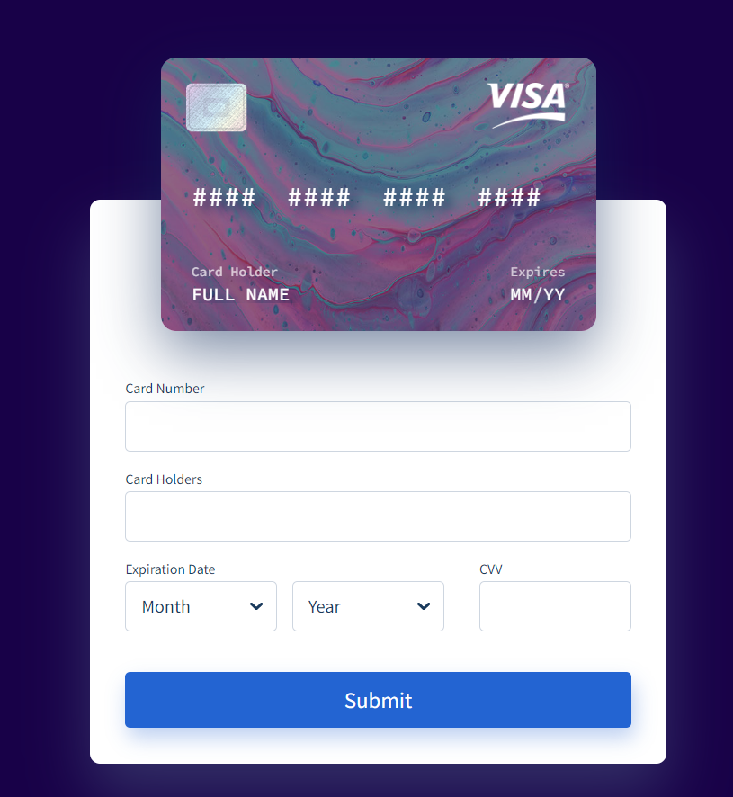

A pen created on Vinishireis

Title: Payment Card
---
A payment card, commonly known as a credit or debit card, is a plastic card issued by a financial institution that allows the cardholder to make electronic transactions. These cards have become an essential part of modern financial transactions, offering convenience and security to consumers and businesses alike.

Payment cards typically come in two main types: credit cards and debit cards. Credit cards allow users to borrow money from the issuing bank to make purchases, with the understanding that they will repay the borrowed amount along with any applicable interest. Debit cards, on the other hand, are linked directly to the cardholder's bank account, allowing them to make purchases using their own funds.

One of the key features of payment cards is their widespread acceptance, both online and in physical stores. They are accepted by a vast network of merchants globally, making them a convenient payment method for various goods and services. Additionally, payment cards offer security features such as encryption, PIN codes, and fraud monitoring systems to protect cardholders from unauthorized transactions.

Payment cards also come with benefits such as rewards programs, cashback offers, travel perks, and purchase protection, depending on the card issuer and type. These incentives encourage card usage and loyalty among customers.
---
